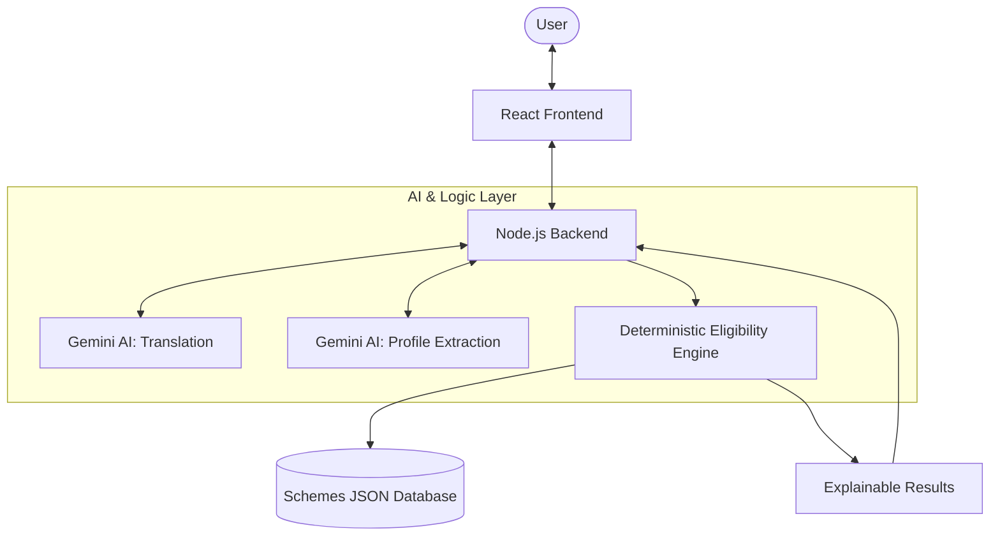

# Saarthi AI - Government Scheme Discovery Assistant


**Saarthi AI** is a professional-grade, multilingual AI assistant designed to bridge the gap between citizens and government welfare programs. It empowers users to discover schemes, scholarships, and grants they are eligible for through natural language conversation, currently focused on the state of **Assam**.

---

## 🏗️ System Architecture

Saarthi AI uses a unique "Pivot-Language" architecture and a deterministic eligibility engine to ensure both accessibility and accuracy.



### The Multilingual Pipeline
1.  **Detection**: The user speaks in English, Assamese, or other regional languages.
2.  **Translation (Pivot)**: Gemini AI translates the input into English (the pivot language) while detecting the source language.
3.  **Extraction**: A second specialized Gemini prompt extracts structured profile data (age, income, occupation, etc.) from the English text.
4.  **Processing**: The backend runs this profile through a deterministic rule-based engine.
5.  **Re-translation**: Results and explanations are translated back to the user's original language.

---

## 🔒 Deterministic vs. Generative AI

Unlike generic chatbots that might "hallucinate" eligibility, Saarthi AI separates **Language Understanding** from **Decision Logic**:

*   **Generative AI (Gemini)**: Used strictly for Natural Language Understanding (NLU) and translation. It understands *what* the user is saying.
*   **Deterministic Engine (Custom Logic)**: Used for eligibility matching. It follows strict rules defined in the database. If a scheme requires "Age > 18", the logic checks this numerically. 
*   **Trust Indicators**: Every result includes clear "Reasons for Eligibility" or "Missing Information" badges, ensuring transparency.

---

## 🛠️ Tech Stack

### Frontend
- **React 19**: Modern component-based architecture.
- **Vite**: Ultra-fast build tool for development.
- **Vanilla CSS**: Custom design system with modern tokens (no bulky frameworks).
- **Typography**: Space Grotesk (General), Poppins (Headings), Noto Sans Bengali (Multilingual).

### Backend
- **Node.js 18+**: Robust server-side environment.
- **Express 5.2**: Lightweight web framework for API routing.
- **Google Generative AI SDK**: Direct integration with Gemini 2.5 Flash Lite.
- **JSON-based Data**: High-performance, schema-less initial data storage for schemes.

---

## 📁 Project Structure

```text
saarthi-ai-web/
├── frontend/
│   ├── src/
│   │   ├── components/    # Reusable UI (ChatInterface, SchemeCard, etc.)
│   │   ├── services/      # api.js - Centralized Axios/Fetch calls
│   │   ├── styles/        # main.css - Design System (Gradients, Tokens)
│   │   └── App.jsx        # Main application entry
│   └── package.json       # Frontend dependencies (React, Vite)
├── backend/
│   ├── src/
│   │   ├── routes/        # API Endpoints (/api/chat, /api/schemes)
│   │   ├── controllers/   # Request orchestration logic
│   │   ├── services/      # CORE LOGIC: llm.service.js, eligibility.service.js
│   │   └── data/          # schemes.json - The official scheme database
│   └── .env               # Configuration (API Keys, PORT)
└── README.md              # Documentation
```

---

## 🚀 Getting Started

### Prerequisites
- Node.js (v18.x or higher)
- npm or yarn
- A Google Gemini API Key from [Google AI Studio](https://aistudio.google.com/app/apikey)

### 1. Repository Setup
```bash
git clone https://github.com/YOUR_USERNAME/saarthi-ai-web.git
cd saarthi-ai-web
```

### 2. Backend Configuration
```bash
cd backend
npm install
```
Create a `.env` file in the `backend/` directory:
```env
GEMINI_API_KEY=your_actual_api_key_here
PORT=3001
GEMINI_MODEL=gemini-2.5-flash-lite
```
Start the backend:
```bash
npm start
```

### 3. Frontend Configuration
Open a new terminal:
```bash
cd frontend
npm install
npm run dev
```
The application will be accessible at `http://localhost:5173`.

---

## 📡 API Reference

| Endpoint | Method | Payload | Description |
| :--- | :--- | :--- | :--- |
| `/api/chat` | POST | `{ "message": string, "language": string }` | Processes AI chat and returns eligibility. |
| `/api/schemes` | GET | - | Returns the full list of available schemes. |
| `/api/schemes/:id` | GET | - | Returns detailed information for a specific scheme. |
| `/api/health` | GET | - | System health check and uptime. |

---

## 🗺️ Roadmap
- [ ] **SQL Migration**: Transitioning from JSON to PostgreSQL for enterprise-level scaling.
- [ ] **Voice Integration**: Direct Assamese/Hindi speech-to-text.
- [ ] **Document Assistant**: Automatic OCR for checking document validity.
- [ ] **Admin Dashboard**: For government officials to add/update schemes easily.

---

Documentation maintained by the Saarthi AI Team.
